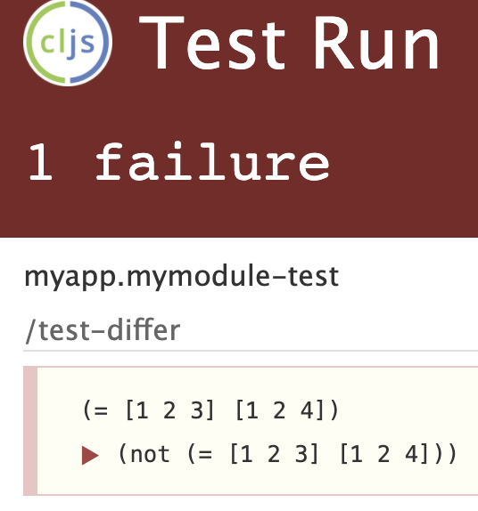
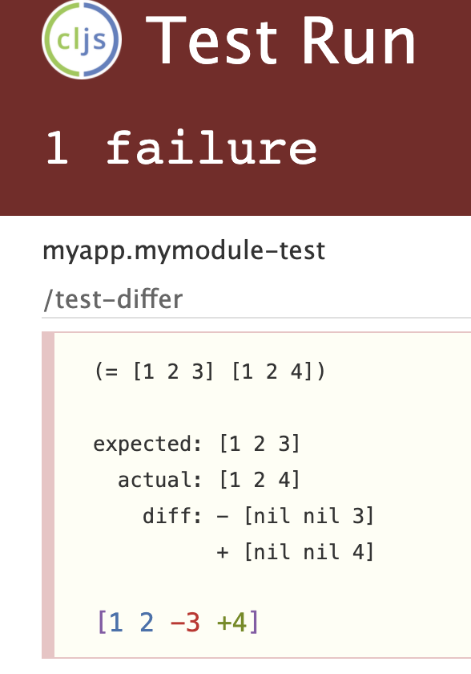

Some helpers for running shadow-cljs tests.

## Usage

First, add this to your shadow-cljs.edn:

```
[org.clojars.lucywang000/shadow-test-utils "0.0.2"]
```

For deps.edn:

```clojure
org.clojars.lucywang000/shadow-test-utils {:mvn/version "0.0.2"}
```

Restart your shadow-cljs process, and you shall have the tests filtering working. 

For the custom browser test reporter to work, modify the `preloads` of your `:browser-test` target:

```clojure
:builds {
  :test {:target   :browser-test
         :devtools {:preloads [shadow-test-utils.pretty-diff]}}
}
```

## Shadow-cljs Test filtering

This library add kaocha-like tests filtering to shadow-cljs:

- If there are tests that are annotated with `^:focus` metadata, then only those tests would be executed. This is useful to only run the test that are relevant to the current piece of code being developed.
- If there are tests that are marked with `^:skip` metadata, then these tests would be ignored. This is useful to e.g. not execute flaky tests without comment out the whole test code, which could result in unnecessary huge git diff.

`(deftest ^:focus foo-test)` is like `it.only`/`test.only` in mocha/jest, `(deftest ^:skip foo-test ...)` is like `it.skip`/`test.skip` in mocha/jest

`:focus/:skip` metadata can also be used at namespace level with similar effects, in which case whole namespace is considered as a whole to be executed or ignored.

## Shadow-cljs prettified browser test reporter

before:



after:


